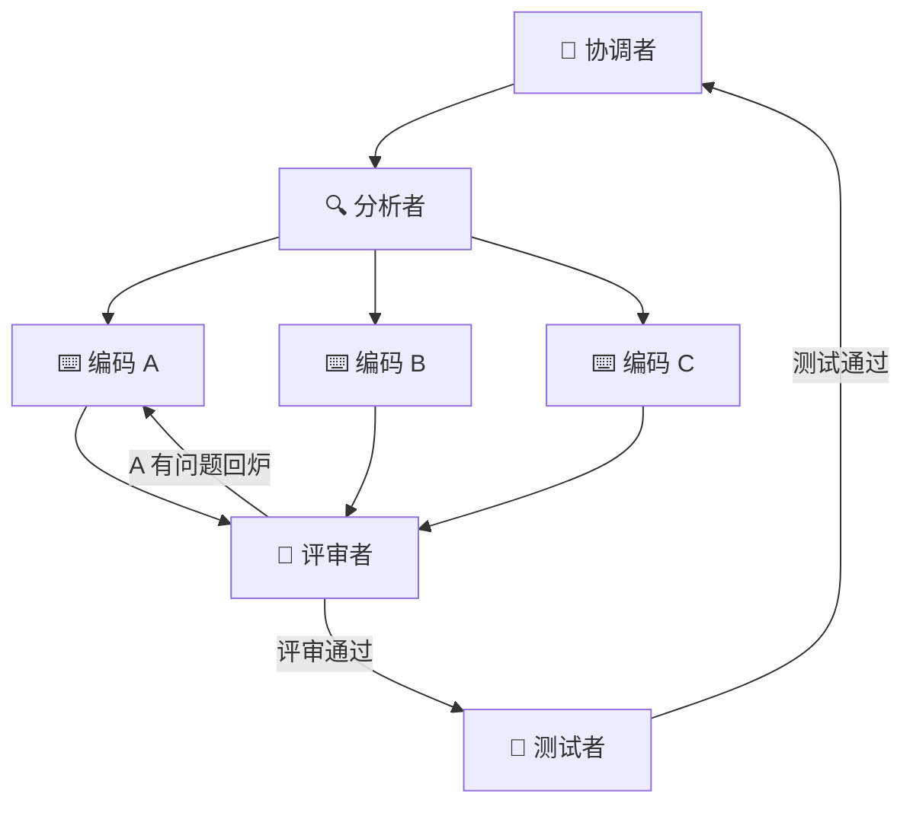

# dsh-team

多 Agent 团队编排框架 —— 把复杂任务交给**角色化的 agent 团队**协作完成。

一个 DeepSeek Harness（`dsh`）插件，提供两套编排范式：

- **顺序接力（loop 工程）**：一条「协调 → 分析 → 编码 → 评审 → 测试」的链 + 回滚闭环。
- **图编排（graph 工程）**：把任务建模成**节点 + 边**的有向无环图（DAG），支持并行 fan-out、条件边路由、join 汇聚。

## 起源

源于我的 [MathModeling-Agent](https://github.com/zhuobichen/MathModeling-Agent) 项目——一个 5 角色（建模/编码/解析/评审/写作）协作的数学建模多 Agent 系统。我把其中的**多 Agent 编排经验**抽离、通用化，做成了任何复杂任务都能用的 DSH 技能包。

## 团队角色

| 角色 | 职责 |
|------|------|
| `team-lead` | 协调者：分解任务、委派、汇总交付 |
| `analyst` | 分析者：需求分析、方案设计 |
| `coder` | 编码者：按方案实现 |
| `reviewer` | 评审者：质量把关、代码评审 |
| `tester` | 测试者：验证测试 |
| `team-workflow` | 接力工作流：顺序接力的分工与协作规范 |
| `team-graph` | 图编排：把任务建模成 DAG，动态决定拓扑 |

## 顺序接力（loop）

```
team-lead ──► analyst ──► coder ──► reviewer ──► tester ──► team-lead（汇总）
```

- 上一个角色的**输出**是下一个角色的**输入**
- reviewer 发现问题 → 回给 coder → 再评审
- tester 验证不通过 → 回给 coder → 再测试

## 图编排（graph）

顺序接力是一条链，图编排是**节点 + 边**的 DAG：

- **节点（node）** = 一次角色委派
- **边（edge）** = 数据/控制流
- **条件边（conditional edge）** = 按结果路由（评审失败 → 回炉 coder）
- **扇出（fan-out）** = 拆成多个并行节点（3 个 coder 同时写不同模块）
- **汇聚（join）** = 合并并行分支（reviewer 汇总所有 coder 的代码）

内置 3 个预设图模板（`graphs/`）：

| 模板 | 用途 | 并行单元 |
|------|------|---------|
| `graph-dev-team` | 软件开发 | 3 个并行 coder |
| `graph-research-team` | 多主题调研 | 3 个并行 analyst |
| `graph-audit-team` | 多维度审查 | 3 个并行 reviewer（正确性/安全/性能） |

agent 会从模板出发，按任务规模**动态改拓扑**，执行前用 Mermaid 把 DAG 画出来，让编排逻辑可见。示例（开发团队）：



## 安装

```sh
dsh plugin --profile web add dsh-team
# 或终端 profile
dsh plugin --profile cc-tui add dsh-team
```

安装后，`dsh-team` 的 7 个技能 + 3 个图模板会注册进 skill registry。

## 使用

无需手动调用。当任务足够复杂时，直接描述任务，agent 会自动选择编排范式：

- 有清晰先后依赖 → 顺序接力
- 有可并行的子任务 → 图编排（fan-out + 条件边 + join）

也可以显式触发：

```
用团队接力完成：重构这个项目的 auth 模块
用图编排完成：并行调研 A/B/C 三个方案的优劣，再交叉评审
```

## 项目结构

```
dsh-team/
├── cordis.yml          # bundle patch（声明插件入口）
├── package.json        # dsh.bundle manifest
├── src/index.ts        # 插件入口（注册 skills + 图模板 + Mermaid 渲染）
├── skills/             # 7 个团队角色 SKILL.md
│   ├── team-workflow/  # 顺序接力工作流
│   ├── team-graph/     # 图编排（节点-边 DAG）
│   ├── team-lead/
│   ├── analyst/
│   ├── coder/
│   ├── reviewer/
│   └── tester/
├── graphs/             # 3 个声明式 DAG 模板
│   ├── dev-team.json
│   ├── research-team.json
│   └── audit-team.json
└── README.md
```

## License

MIT
